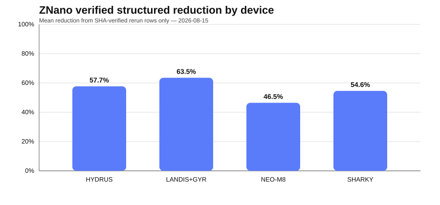
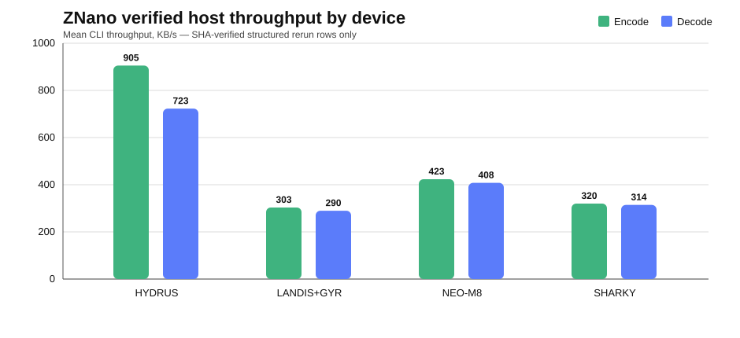
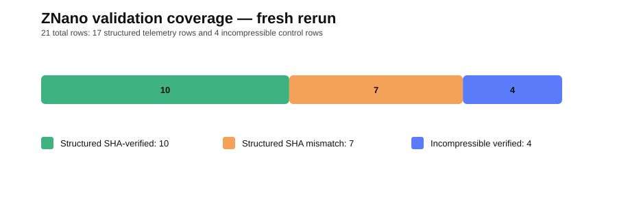
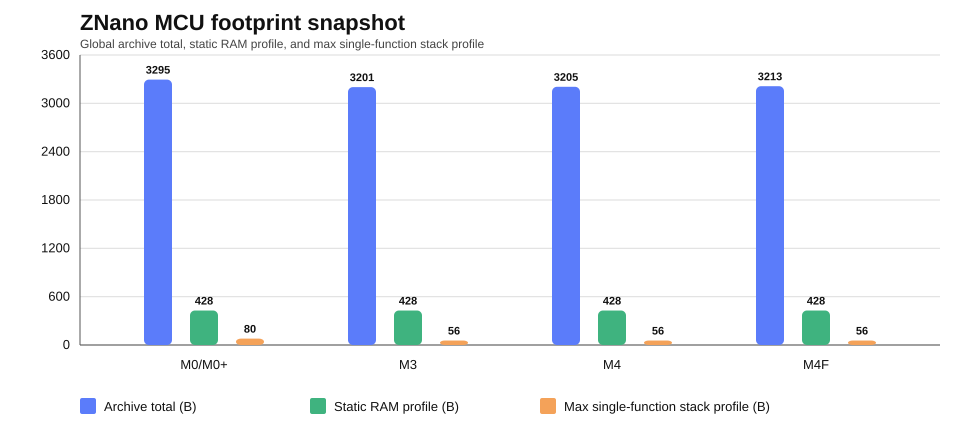
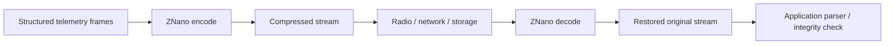

# ZNano

**Proprietary lossless compression for structured telemetry, metering, and constrained embedded systems.**

> **ZNano** is the current product name. Earlier benchmark material may refer to **NanoV3**; both names belong to the same technology lineage.

ZNano is built for structured device payloads where exact reconstruction, small implementation footprint, predictable integration behavior, and measurable bandwidth reduction matter. This repository is the **public technical showcase** for ZNano. The proprietary core source, protected releases, internal test tooling, and customer-specific integrations remain private.

## Verified public snapshot

| Metric | Current evidence |
|---|---:|
| SHA-verified structured rerun rows | **10 / 10 pass** |
| SHA-verified incompressible control rows | **4 / 4 pass** |
| Verified structured reduction range | **23.46% – 90.85%** |
| Verified structured mean reduction | **56.32%** |
| Verified structured median reduction | **58.14%** |
| Fresh host encode mean | **1.407 ms** |
| Fresh host decode mean | **1.537 ms** |
| Max host RSS delta in fresh rerun | **64 KB** |
| MCU SDK targets represented in build artifacts | **Cortex-M0/M0+, M3, M4, M4F** |

Fresh host reruns were executed on **Darwin 25.5.0 arm64**, with **30 measured runs after 5 warmups** per encode/decode command. Host timing is not MCU cycle timing.

> **Benchmark refresh in progress:** the current public figures above are preserved from the last completed rerun until the expanded matrix and current binary are fully re-measured. New integration capabilities documented below are not used to rewrite historical benchmark values.

## Benchmark visuals

### Verified structured reduction by device

### Verified host throughput by device

### Validation coverage

### MCU footprint snapshot

## Devices represented in the public evidence set

| Device | Domain | Public benchmark evidence |
|---|---|---|
| **HYDRUS-F06-006-WATER** | Water metering | Structured telemetry, multi-frame streams |
| **LANDIS+GYR E450** | Electricity metering | Structured telemetry, multi-frame streams |
| **NEO-M8-FW3** | GNSS / positioning | GNSS telemetry, multi-frame streams |
| **SHARKY-775-159** | Thermal energy metering | Heat-meter telemetry, multi-frame streams |

Detailed legacy reports remain available in this repository, while the current consolidated rerun and publication guardrails live in [`docs/`](docs/).

## Technology lineage: Ripple → ZNano

ZNano's origins predate the current device-agnostic benchmark suite.

An early generation of the technology was developed as a **customer-specific gas-meter telemetry POC for Ripple Metering**. That codec was designed around one known metering workload and was successfully integrated into the target environment.

The research that followed focused on a larger question: whether the principles proven on that specific workload could evolve into a reusable lossless codec that was no longer dependent on one customer, one meter, or one fixed telemetry format.

That transition — from **custom metering codec** to **device-agnostic structured-telemetry compression** — is the core technology lineage that led to ZNano.

The preserved Ripple real-data regression set still provides useful historical evidence: two functioning ZHex-lineage implementations complete **5/5 valid round-trips** on the five real/realtime cases, with **63.48% average reduction** on that historical dataset.

- [`docs/RIPPLE_TO_ZNANO.md`](docs/RIPPLE_TO_ZNANO.md) — historical POC and evolution from customer-specific to device-agnostic compression
- [`docs/RIPPLE_ZHEX_LEGACY_BENCHMARK.md`](docs/RIPPLE_ZHEX_LEGACY_BENCHMARK.md) — real-data historical regression results

The public history intentionally documents outcomes and engineering evolution without disclosing the proprietary compression mechanism.

## What is verified today

- **Lossless round-trip** on the 10 structured rerun rows whose normalized decoded output matches the input SHA-256.
- **Lossless round-trip** on all 4 deterministic incompressible control cases in the fresh rerun.
- **Concatenated multi-frame processing** with 6, 10, 20, and 40-frame cases depending on dataset.
- **Decode-all stream mode** using `d 0` in the benchmark path.
- **Host timing and RSS behavior** for the current CLI benchmark binary.
- **SDK build artifacts and footprint measurements** for Cortex-M0/M0+, Cortex-M3, Cortex-M4 soft-float, and Cortex-M4F hard-float.
- The optimized MCU SDK implementation path is documented as using **fixed internal buffers and no dynamic allocation**; this statement does not apply to every historical/legacy source path.

## Random-access decoding

ZNano supports **random-access decoding** within a multi-frame compressed stream: an application can request one frame without first reconstructing every frame that precedes it.

Practical uses include:

- extracting one meter reading from a stored compressed batch;
- re-reading or retransmitting one frame from an addressable device log;
- decoding into a single-frame output buffer instead of rebuilding the complete stream.

Random access is an addressing capability, not a loss-tolerance feature. The compressed stream must be available in randomly readable storage or already buffered before selective decoding is requested.

Dedicated selective-decode timing and working-memory measurements will be added to the benchmark set after the current rerun is complete.

## Payload scrambling

ZNano provides an optional **payload scrambling** mode for the encoded representation. The transformation is deterministic and reversible, and the information required for reversal travels with the stream.

Typical reasons to enable it are reducing immediately visible repeated value patterns and making compressed payloads less readable during casual inspection.

**Scrambling is not encryption.** It provides no confidentiality, integrity, authentication, privacy, or compliance guarantee. It does not alter radio modulation, improve link budget or range, or provide error correction.

The current integration contract adds **one byte of stream overhead** when scrambling is enabled. Timing impact will be published from measured reruns rather than estimated.

## Important engineering boundaries

ZNano's public documentation deliberately distinguishes between **measured**, **calculated**, and **estimated / target-dependent** metrics.

- Seven structured rerun rows report a decoded SHA-256 mismatch. Their compression figures are preserved for engineering investigation but are **excluded from strong public lossless claims** until the expanded rerun replaces the historical evidence set.
- Incompressible pseudo-random payloads round-trip correctly in the fresh rerun but can **expand**. Applications that require a strict “never larger than input” transport guarantee need an explicit wrapper/bypass policy.
- Host CLI timing is **not** MCU runtime performance.
- Host RSS delta is **not** direct MCU RAM measurement.
- Static stack figures are profile artifacts, **not runtime peak stack measurements**.
- Bit-identical repeated encoded output has not yet been explicitly logged, so this repository does not use that as a public determinism claim.
- Payload scrambling is **not a security control**.
- Random access does **not** imply independent corruption containment or packet-loss resilience.

## MCU footprint snapshot

Measured rebuilt SDK archive totals:

| Target | Global encode + decode | Encode only | Decode only |
|---|---:|---:|---:|
| Cortex-M0/M0+ | 3295 B | 1603 B | 1039 B |
| Cortex-M3 | 3201 B | 1567 B | 1019 B |
| Cortex-M4 soft-float | 3205 B | 1567 B | 1023 B |
| Cortex-M4F hard-float | 3213 B | 1567 B | 1023 B |

Static profile harness values reported for the current evidence set:

| CPU | Flash approx | Static RAM approx | Max single-function stack |
|---|---:|---:|---:|
| Cortex-M0 | 2835 B | 428 B | 80 B |
| Cortex-M3 | 2459 B | 428 B | 56 B |
| Cortex-M4 | 2483 B | 428 B | 56 B |

These values describe the profiled build/harness and exclude caller-owned integration buffers where applicable.

## Integration model

For random access, scrambling, size limits, evidence classification, CLI behavior, and the embedded SDK model, see [`docs/ARCHITECTURE.md`](docs/ARCHITECTURE.md).

## Documentation

- [`docs/BENCHMARKS_2026-08-15.md`](docs/BENCHMARKS_2026-08-15.md) — last completed host rerun; will be replaced when the expanded current rerun is complete
- [`docs/RIPPLE_TO_ZNANO.md`](docs/RIPPLE_TO_ZNANO.md) — origins in the Ripple gas-meter telemetry POC and evolution toward the current device-agnostic model
- [`docs/RIPPLE_ZHEX_LEGACY_BENCHMARK.md`](docs/RIPPLE_ZHEX_LEGACY_BENCHMARK.md) — historical real-data Ripple regression benchmark
- [`docs/PUBLIC_CLAIMS.md`](docs/PUBLIC_CLAIMS.md) — claims that are currently supportable and claims to avoid
- [`docs/MCU_PROFILE.md`](docs/MCU_PROFILE.md) — target builds, footprint, RAM/stack interpretation, and QEMU functional evidence
- [`docs/ARCHITECTURE.md`](docs/ARCHITECTURE.md) — public integration and evidence model

## Public vs. private

**Public in this repository**

- benchmark methodology and evidence
- publication-safe metrics
- charts and architecture diagrams
- integration-oriented documentation
- known limitations and validation boundaries
- technology-lineage documentation that does not expose the proprietary codec mechanism

**Private / controlled distribution**

- proprietary compression core source
- protected release binaries and SDK releases
- internal test harnesses and sensitive datasets
- customer-specific integrations
- release engineering and CI/CD

## Commercial evaluation

For technical evaluation, licensing, or integration discussions:

**Zetako S.à r.l. — Luxembourg**  
**https://zetako.ai/**  
**contact@zetako.ai**

---

© Zetako. Proprietary technology. Public documentation in this repository does not grant rights to reproduce, reverse engineer, or redistribute the ZNano implementation.
