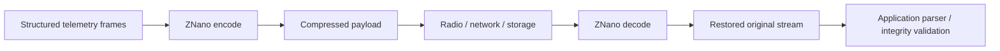
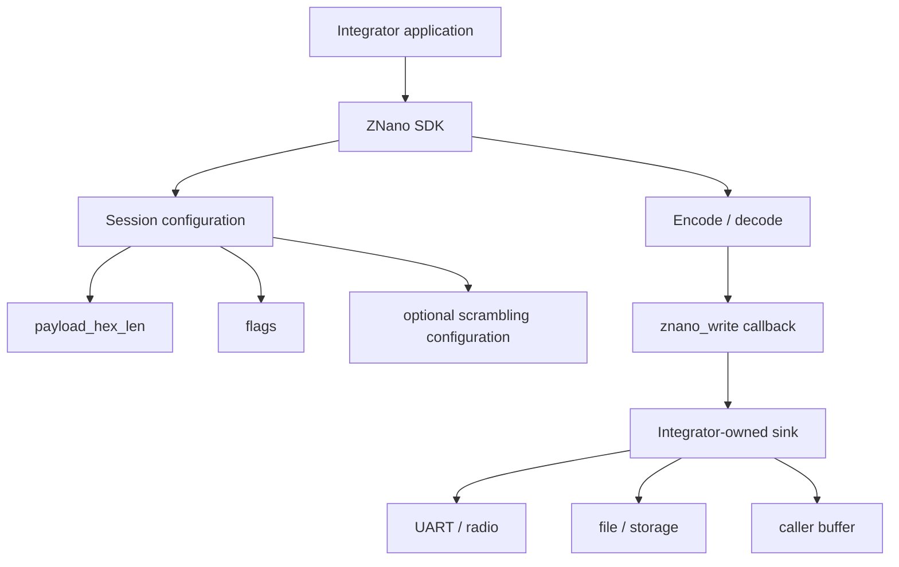
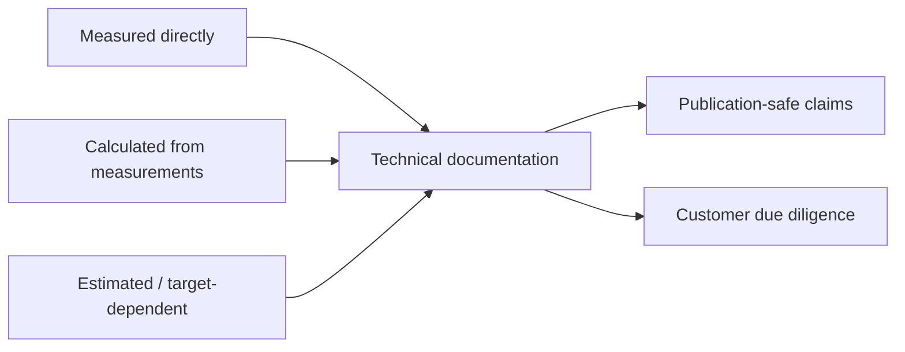
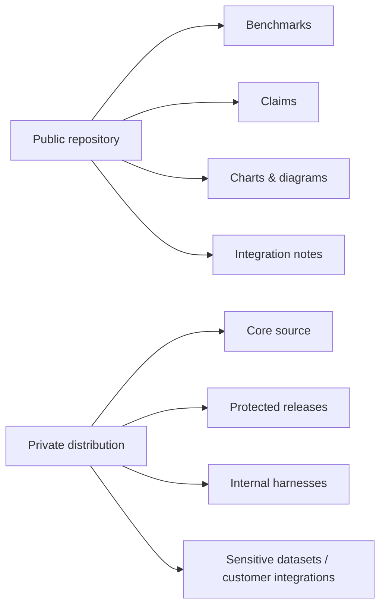

# ZNano Architecture & Integration

ZNano is presented publicly as a **proprietary structured-payload compression engine**. This repository documents what was measured, how the integration model works at a high level, and which claims are safe to make without publishing the proprietary core.

## High-level data flow



## Embedded integration model



## Evidence model



### Measured directly

Examples include:

- input/output size
- benchmark timing and timing variance
- SHA-256 round-trip integrity result
- host RSS peak and baseline
- MCU build/archive section sizes
- static stack profile artifacts

### Calculated

Examples include:

- compression ratio
- reduction percentage
- throughput
- aggregate mean/median
- RSS delta upper bound

### Estimated / target-dependent

Examples include:

- runtime MCU RAM outside the measured profile harness
- application-level buffer budget
- board-level throughput before physical target measurement
- energy and battery impact

## CLI integration contract

The benchmark CLI consumes hexadecimal ASCII payloads.

```text
nanov3 e  <payload_size_hex_chars> <hex_data>
nanov3 ex <seed> <payload_size_hex_chars> <hex_data>
nanov3 d  <mode> <encoded_hex_data>
nanov3 dx <mode> <encoded_hex_data>
```

Public-safe interpretation:

- `payload_size` is one frame size in **hex characters**, not bytes.
- Multiple frames can be concatenated into one stream.
- Decode mode `0` reconstructs the full stream.
- A non-zero decode mode selects one frame from a multi-frame stream.
- Encode/decode configuration must match on both sides.
- Scrambling mode is self-describing at decode time and does not require an external key exchange.

## Random-access decoding

ZNano supports **random-access decoding** within a compressed multi-frame stream. An application can request one frame without first reconstructing all frames that precede it.

This is useful when compressed telemetry is retained in addressable storage and only one reading needs to be retrieved or retransmitted.

Typical integration consequences:

- a gateway can recover one reading from a stored compressed batch without rebuilding the complete batch;
- a device can re-read a selected frame from an addressable compressed log;
- selective decode can use a caller output buffer sized for one frame rather than the complete reconstructed stream.

Random access is an addressing capability, not an error-resilience guarantee. The encoded stream still needs to be available through randomly readable storage or a buffered representation before selective decode is requested.

Dedicated random-access timing and working-memory measurements will be published separately once the current benchmark rerun is complete.

## Payload scrambling

ZNano provides an optional **payload scrambling** mode. The encoded representation can be transformed into a deterministic, reversible scrambled payload before transport or storage.

The scrambling information required for reversal is carried with the encoded stream, so the decoder does not need a separate synchronization channel.

Typical reasons to enable scrambling include reducing immediately visible repeated value patterns and making the compressed representation less readable during casual inspection.

### Scope and limitations

- Scrambling is **not encryption** and provides no confidentiality, integrity, authentication, privacy, or compliance guarantee.
- Scrambling operates on the encoded payload only; it does not alter radio modulation or physical-layer behavior.
- It provides no processing gain, link-budget improvement, range extension, or channel-error correction.
- Security-sensitive deployments must use an independent cryptographic control when confidentiality or authenticity is required.

The current integration contract adds **one byte of encoded-stream overhead** when scrambling is enabled. Timing impact will be published with the current rerun rather than inferred.

## Integration limits

| Parameter | V1 limit |
|---|---:|
| Frame size (`payload_hex_len`) | 1 to **4095 hex characters** |
| Input stream length | Exact multiple of the frame size |
| Input stream length | Up to **65535 hex characters** |
| Encoded stream length | Up to **65535 hex characters** |
| Frame count | Bounded by total stream length |

Applications whose data may exceed these limits must segment the input into multiple independent streams before encoding. Each stream is then encoded, transmitted, stored, and decoded independently, and random access applies within one stream.

For byte-oriented telemetry, an **even frame size is recommended** so each frame maps to a whole number of bytes.

Sizes in the host benchmark documentation are reported in payload bytes. The CLI itself consumes and emits ASCII hexadecimal representation, where one payload byte corresponds to two hex characters.

## Embedded SDK integration contract

The current public evidence set describes a compact C API conceptually equivalent to:

```c
znano_init(&cfg);
znano_encode(input_hex, input_len);
znano_decode(encoded_hex, encoded_len);
```

The exact proprietary SDK surface may vary by protected release. Selective-frame decoding is exposed through the decode configuration rather than requiring the caller to reconstruct earlier frames first.

The integrator owns the output sink through a callback such as:

```c
uint16_t znano_write(const char* data, uint16_t len);
```

Integration responsibilities include:

- initialize configuration before encode/decode;
- use a frame size inside the documented V1 limits;
- prefer an even frame size for byte-oriented telemetry;
- keep encode/decode configuration consistent;
- segment inputs that can exceed the V1 stream-length boundary;
- return the complete requested length from the write callback;
- budget caller-owned buffers separately from the core profile;
- treat the current SDK implementation as single-instance / not thread-safe unless a later SDK explicitly changes that contract;
- treat scrambling as payload formatting, never as a security control.

## Customer due-diligence checklist

A technical evaluator should be able to find answers to these questions in the public repository:

1. **Does it reconstruct the tested payload exactly?** — SHA-256 result is shown per benchmark row.
2. **How much reduction was observed?** — per-row figures and aggregates are published with their measurement environment.
3. **What happens to incompressible data?** — it can expand; this is disclosed.
4. **Can a single frame be decoded independently?** — random-access decoding is part of the V1 integration contract.
5. **What are the size limits?** — frame and stream bounds are documented above.
6. **How fast is it?** — host CLI timing is published with environment and scope.
7. **How large is the MCU implementation?** — rebuilt archive footprints are published.
8. **What is measured versus estimated?** — the distinction is explicit.
9. **Where is the core source?** — it is proprietary and intentionally not published here.

## Public/private boundary



The public repository is meant to make ZNano **understandable and technically reviewable without making it reproducible from source**.
