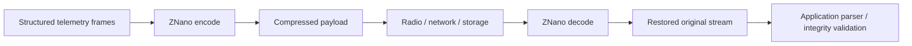
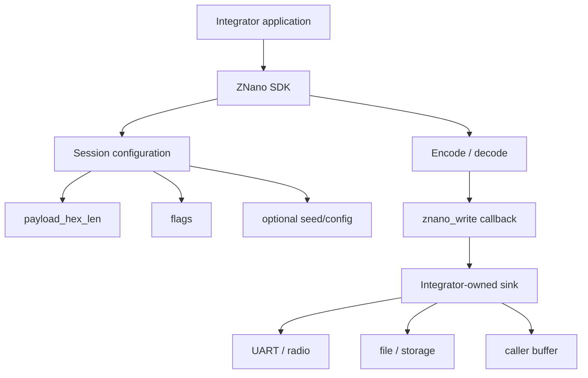
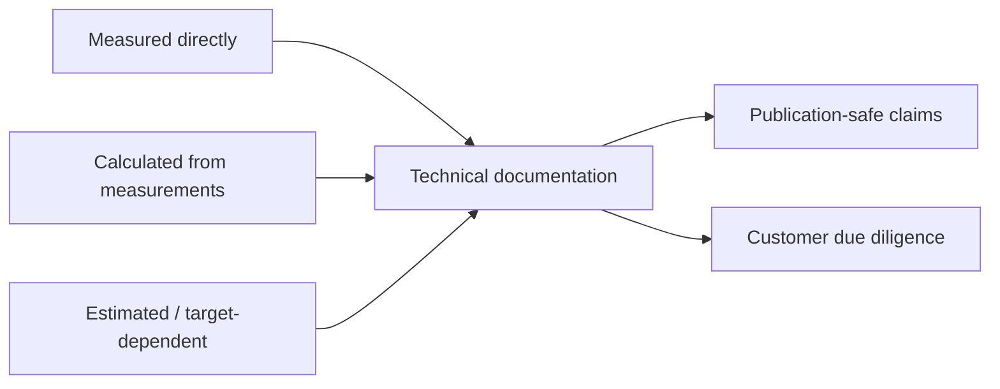
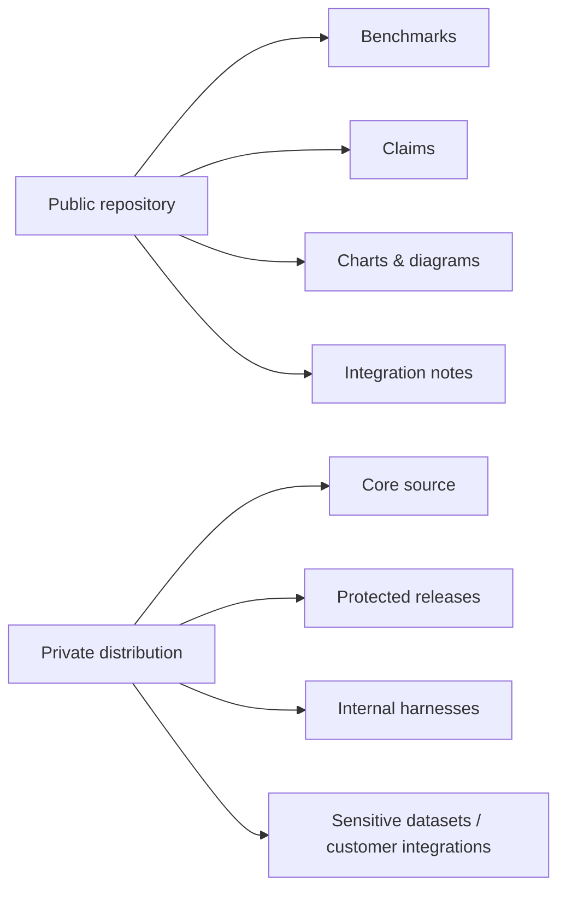

# ZNano Architecture & Integration

ZNano is presented publicly as a **proprietary structured-payload compression engine**. This repository documents what was measured, how the integration model works at a high level, and which claims are safe to make without publishing the proprietary core.

## High-level data flow



## Embedded integration model



## Evidence model



### Measured directly

Examples include:

- input/output size
- benchmark timing and timing variance
- SHA-256 round-trip integrity result
- host RSS peak and baseline
- MCU build/archive section sizes
- static stack profile artifacts

### Calculated

Examples include:

- compression ratio
- reduction percentage
- throughput
- aggregate mean/median
- RSS delta upper bound

### Estimated / target-dependent

Examples include:

- runtime MCU RAM outside the measured profile harness
- application-level buffer budget
- board-level throughput before physical target measurement
- energy and battery impact

## CLI integration contract

The benchmark CLI consumes hexadecimal ASCII payloads.

```text
nanov3 e  <payload_size_hex_chars> <hex_data>
nanov3 ex <seed> <payload_size_hex_chars> <hex_data>
nanov3 d  0 <encoded_hex_data>
nanov3 dx 0 <encoded_hex_data>
```

Public-safe interpretation:

- `payload_size` is one frame size in **hex characters**, not bytes.
- Multiple frames can be concatenated into one stream.
- Decode mode `0` reconstructs the full stream.
- Encode/decode configuration must match on both sides.

## Embedded SDK integration contract

The current public evidence set describes a compact C API conceptually equivalent to:

```c
znano_init(&cfg);
znano_encode(input_hex, input_len);
znano_decode(encoded_hex, encoded_len);
```

The integrator owns the output sink through a callback such as:

```c
uint16_t znano_write(const char* data, uint16_t len);
```

Integration responsibilities include:

- initialize configuration before encode/decode;
- use a valid even `payload_hex_len`;
- keep encode/decode configuration consistent;
- return the complete requested length from the write callback;
- budget caller-owned buffers separately from the core profile;
- treat the current SDK implementation as single-instance / not thread-safe unless a later SDK explicitly changes that contract.

## Customer due-diligence checklist

A technical evaluator should be able to find answers to these questions in the public repository:

1. **Does it reconstruct the tested payload exactly?** — SHA-256 result is shown per benchmark row.
2. **How much reduction was observed?** — verified and unverified rows are separated.
3. **What happens to incompressible data?** — it can expand; this is disclosed.
4. **How fast is it?** — host CLI timing is published with environment and scope.
5. **How large is the MCU implementation?** — rebuilt archive footprints are published.
6. **What is measured versus estimated?** — the distinction is explicit.
7. **Where is the core source?** — it is proprietary and intentionally not published here.

## Public/private boundary



The public repository is meant to make ZNano **understandable and technically reviewable without making it reproducible from source**.
